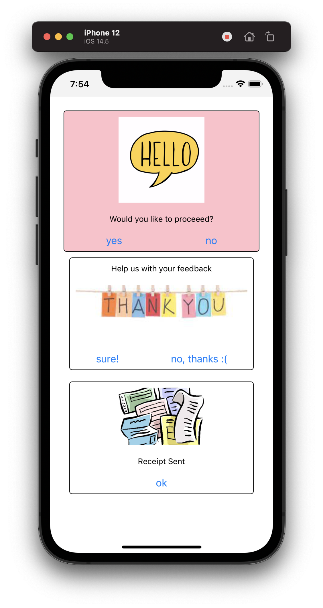

# kodif hackathon 05/23

This is a UIKit demo. It enables drawing components dynamically assuming it comes from server.



### Prerequisites

- xcode
- node


## Client

```bash
# install react-native
npm i -g react-native

# run (xcode must be installed)
cd kodif & react-native run-ios
```

## Server 

```bash

# install server utility cli
npm install -g tj/serve

# serve directory which will have 
serve .

# check http://127.0.0.1:3000/ui.json

```


## FAQ

- How to change styles?
    - Look at styling section in links and change ui.json accordingly


## Links
- [React native setup](https://blog.theodo.com/2016/12/bootstrap-a-cross-platform-app-in-10-minutes-with-react-native/)
- [React components](https://reactnative.dev/docs/components-and-apis)
- [Styling](https://reactnative.dev/docs/view-style-props)